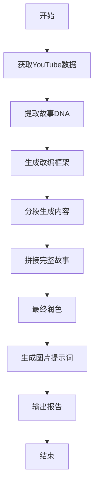

# YouTube Story Generator V2 - 系统文档

## 目录
1. [系统概述](#系统概述)
2. [核心功能](#核心功能)
3. [系统架构](#系统架构)
4. [工作流程](#工作流程)
5. [使用指南](#使用指南)
6. [配置说明](#配置说明)
7. [API接口](#api接口)
8. [输出格式](#输出格式)
9. [故障排除](#故障排除)
10. [版本更新](#版本更新)

---

## 系统概述

YouTube Story Generator V2 是一个基于AI的自动化故事创作系统，能够从YouTube视频中提取内容，通过多阶段处理生成具有争议性和话题性的改编故事。

### 主要特点
- **多阶段处理流程**：从DNA提取到最终润色的完整创作链
- **争议性改编策略**：基于热门评论的"槽点放大"策略
- **9步故事结构**：遵循经过验证的叙事框架
- **智能图片生成**：自动生成SD提示词，支持批量图片创建
- **灵活配置**：支持自定义片段数量、字数、图片密度等

### 技术栈
- **Python 3.8+**
- **Google Gemini API** (通过NewAPI代理)
- **YouTube API** (通过代理访问)
- **日志系统**：完整的调试和监控支持

---

## 核心功能

### 1. 视频内容提取
- 自动获取YouTube视频字幕
- 提取视频元数据（标题、描述、观看数等）
- 抓取热门评论作为改编依据

### 2. 故事DNA提取
- 分析原始内容的核心要素
- 识别人物、冲突、转折点
- 提取可放大的"槽点"

### 3. 框架生成
- 基于9步上瘾结构设计故事骨架
- 为每个步骤分配字数和节奏
- 设计核心角色的视觉特征

### 4. 分段生成
- 独立生成每个故事片段
- 保持上下文连贯性（传递前500字）
- 支持断点续写和缓存

### 5. 图片提示词生成
- 从框架提取角色特征
- 智能识别关键场景
- 生成专业的SD提示词

---

## 系统架构

```
youtube_story_creator_v2.py (主程序)
├── 客户端层
│   ├── YouTubeAPIClient (视频数据获取)
│   └── GeminiClient (AI内容生成)
├── 处理层
│   ├── TextProcessor (文本处理)
│   └── ContextManager (上下文管理)
├── 生成层
│   ├── phase1_extract_dna (DNA提取)
│   ├── phase2_generate_framework (框架生成)
│   ├── phase3_generate_segments_simple (片段生成)
│   ├── phase4_concat_segments (拼接)
│   ├── phase5_polish (润色)
│   └── generate_image_prompts_v2 (图片提示词)
└── 输出层
    ├── 文件系统 (分级存储)
    └── 报告生成 (Markdown/JSON)
```

### 目录结构
```
story_result/
└── [creator_name]/
    └── [video_id]/
        ├── raw/                # 原始数据
        │   ├── subtitles.txt
        │   ├── comments.json
        │   └── video_info.json
        ├── processing/         # 处理中间文件
        │   ├── 1_dna.txt
        │   └── 2_framework.txt
        ├── segments/           # 片段文件
        │   ├── segment_01.txt
        │   ├── segment_02.txt
        │   └── ...
        └── final/              # 最终输出
            ├── story.md
            ├── report.md
            ├── sd_prompts_v2.json
            └── sd_prompts_v2.md
```

---

## 工作流程

### 完整流程图


### 详细步骤

#### 第一阶段：DNA提取
1. 分析视频字幕内容
2. 识别核心故事要素
3. 提取人物关系和冲突点
4. 输出：`1_dna.txt`

#### 第二阶段：框架生成
1. 分析热门评论找出"槽点"
2. 设计9步故事结构
3. 规划每步的字数和节奏
4. 创建角色视觉设计
5. 输出：`2_framework.txt`

#### 第三阶段：片段生成（简化版）
1. 提取框架摘要（一次性）
2. 映射9步结构到N个片段
3. 独立生成每个片段
4. 只传递前500字保持连贯
5. 输出：`segment_01-09.txt`

#### 第四阶段：拼接
1. 合并所有片段
2. 添加章节标记
3. 输出：`3_draft.txt`

#### 第五阶段：润色
1. 全文一致性检查
2. 优化过渡和节奏
3. 强化争议性元素
4. 输出：`story.md`

#### 第六阶段：图片生成
1. 提取角色视觉特征
2. 从每个片段提取关键场景
3. 生成SD提示词
4. 输出：`sd_prompts_v2.json/md`

---

## 使用指南

### 安装依赖
```bash
pip install -r requirements.txt
```

### 基本使用
```bash
python youtube_story_creator_v2.py <video_id> <creator_name> [options]
```

### 命令行参数
| 参数 | 说明 | 默认值 |
|------|------|--------|
| `video_id` | YouTube视频ID | 必需 |
| `creator_name` | 创作者名称 | 必需 |
| `--length` | 目标故事长度 | 30000 |
| `--segments` | 片段数量 | 9 |
| `--images-per-segment` | 每片段图片数 | 1 |
| `--sd-prompt` | SD提示词模板 | prompts/sd_image_generator_v2.md |

### 使用示例

#### 1. 基础使用
```bash
# 使用默认配置
python youtube_story_creator_v2.py dQw4w9WgXcQ my_creator
```

#### 2. 自定义片段数量
```bash
# 生成12个片段的故事
python youtube_story_creator_v2.py dQw4w9WgXcQ my_creator --segments 12
```

#### 3. 增加图片密度
```bash
# 每个片段生成3张图片
python youtube_story_creator_v2.py dQw4w9WgXcQ my_creator --images-per-segment 3
```

#### 4. 完整配置
```bash
python youtube_story_creator_v2.py dQw4w9WgXcQ my_creator \
    --length 50000 \
    --segments 15 \
    --images-per-segment 2
```

### 断点续写
系统支持自动断点续写：
- 已生成的片段会自动缓存
- 中断后重新运行会从断点继续
- 缓存文件位于 `segments/` 目录

### 清理缓存
```bash
# 清理特定项目的缓存
rm -rf story_result/my_creator/video_id/segments/

# 清理所有缓存
rm -rf story_result/
```

---

## 配置说明

### 环境变量配置
创建 `.env` 文件：
```env
# Gemini API配置
GEMINI_API_KEY=your_api_key
GEMINI_BASE_URL=https://api.openai-proxy.com/v1beta

# 代理配置
HTTP_PROXY=http://127.0.0.1:7890
HTTPS_PROXY=http://127.0.0.1:7890

# 日志级别
LOG_LEVEL=INFO
```

### 提示词模板
系统使用的提示词模板位于 `prompts/` 目录：
- `dna_extractor.md` - DNA提取提示词
- `framework_generate.md` - 框架生成提示词
- `segment_generator.md` - 片段生成提示词
- `final_polish.md` - 最终润色提示词

### 9步结构映射
```python
# 默认9步结构
nine_steps = {
    1: "钩子开场",
    2: "角色与动机",
    3: "意外转折",
    4: "尝试与失败",
    5: "情绪低谷",
    6: "顿悟与转变",
    7: "最终行动",
    8: "胜利的代价",
    9: "新的悬念"
}
```

---

## API接口

### GeminiClient
```python
class GeminiClient:
    def generate_content(prompt: str) -> str:
        """单次内容生成"""
        
    def generate_content_with_history(prompt: str, history: list) -> str:
        """带历史记录的生成"""
```

### YouTubeAPIClient
```python
class YouTubeAPIClient:
    def get_subtitles(video_id: str) -> str:
        """获取视频字幕"""
        
    def get_video_info(video_id: str) -> dict:
        """获取视频信息"""
        
    def get_comments(video_id: str, max_results: int) -> list:
        """获取热门评论"""
```

---

## 输出格式

### 故事文件 (story.md)
```markdown
# [故事标题]

## 第一章：钩子开场
[内容...]

## 第二章：角色与动机
[内容...]
```

### SD提示词 (sd_prompts_v2.json)
```json
{
  "character_profiles": {
    "角色名": {
      "name": "角色名",
      "visual_description": "详细描述",
      "sd_features": "SD关键词"
    }
  },
  "total_images": 18,
  "images": [
    {
      "segment": 1,
      "scene_index": 1,
      "scene_description": "场景描述",
      "emotion": "情感氛围",
      "sd_prompt": {
        "positive": "正面提示词",
        "negative": "负面提示词"
      }
    }
  ]
}
```

### 报告文件 (report.md)
包含：
- 生成统计（字数、用时等）
- 各阶段输出摘要
- 角色设定
- 章节大纲

---

## 故障排除

### 常见问题

#### 1. API连接失败
**问题**：无法连接到Gemini API
**解决**：
- 检查API密钥是否正确
- 确认代理设置
- 验证网络连接

#### 2. 字幕获取失败
**问题**：无法获取YouTube字幕
**解决**：
- 确认视频ID正确
- 检查视频是否有字幕
- 验证代理是否正常

#### 3. 生成内容过短/过长
**问题**：生成的内容不符合字数要求
**解决**：
- 字数控制通过提示词实现
- 检查 `segment_generator.md` 中的字数要求
- 不要在代码中强制控制字数

#### 4. 编码错误
**问题**：Windows下出现编码错误
**解决**：
```python
# 在脚本开头添加
import sys
sys.stdout.reconfigure(encoding='utf-8')
```

### 日志查看
```bash
# 查看完整日志
tail -f story_result/creator_name/video_id/generation.log

# 查看错误日志
grep ERROR story_result/creator_name/video_id/generation.log
```

---

## 版本更新

### V2.0 (当前版本)
- ✅ 简化的片段生成流程（独立API调用）
- ✅ 9步结构支持
- ✅ 优化的图片生成流程
- ✅ 角色视觉一致性
- ✅ 支持配置每片段图片数量

### V1.0
- 基础的故事生成功能
- 30片段固定结构
- 简单的图片提示词生成

### 计划功能
- [ ] 多语言支持
- [ ] 实时进度推送
- [ ] Web界面
- [ ] 批量处理模式
- [ ] 自动发布到平台

---

## 附录

### 性能优化建议
1. **使用缓存**：避免重复生成已完成的片段
2. **批量处理**：同时处理多个视频时使用异步
3. **API限流**：每5个片段暂停2秒避免触发限制
4. **内存管理**：长故事生成时注意内存使用

### 最佳实践
1. **片段数量**：9-15个片段效果最佳
2. **图片密度**：每片段1-2张图片较为合适
3. **字数控制**：30000-50000字的故事最受欢迎
4. **缓存管理**：定期清理旧项目的缓存文件

### 联系支持
- 项目地址：[GitHub Repository]
- 问题反馈：[Issues]
- 文档更新：查看 `docs/` 目录

---

*最后更新：2025-08-08*