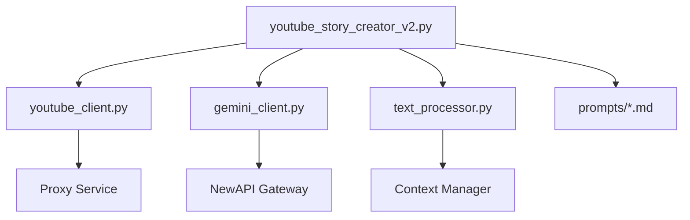

# YouTube Story Generator V2 - 技术架构文档

## 目录
1. [系统架构概览](#系统架构概览)
2. [核心组件详解](#核心组件详解)
3. [数据流设计](#数据流设计)
4. [算法实现](#算法实现)
5. [优化策略](#优化策略)
6. [扩展性设计](#扩展性设计)

---

## 系统架构概览

### 分层架构
```
┌─────────────────────────────────────────────┐
│           Presentation Layer                 │
│         (CLI Interface / Reports)            │
├─────────────────────────────────────────────┤
│           Application Layer                  │
│      (YouTubeStoryCreatorV2 主控制器)        │
├─────────────────────────────────────────────┤
│            Service Layer                     │
│   ┌─────────────┬─────────────┬──────────┐ │
│   │ TextProcessor│ContextMgr  │PromptMgr │ │
│   └─────────────┴─────────────┴──────────┘ │
├─────────────────────────────────────────────┤
│           Integration Layer                  │
│   ┌─────────────┬─────────────┐            │
│   │ GeminiClient│ YouTubeAPI  │            │
│   └─────────────┴─────────────┘            │
├─────────────────────────────────────────────┤
│            Storage Layer                     │
│         (File System / Cache)                │
└─────────────────────────────────────────────┘
```

### 模块依赖图


---

## 核心组件详解

### 1. YouTubeStoryCreatorV2 (主控制器)

#### 职责
- 协调整个生成流程
- 管理各阶段的输入输出
- 处理错误和重试逻辑
- 维护状态和缓存

#### 关键方法
```python
class YouTubeStoryCreatorV2:
    def __init__(self, video_id, creator_name, **kwargs):
        """初始化配置和客户端"""
        
    def run(self):
        """执行完整流程"""
        
    def phase1_extract_dna(self, subtitles):
        """提取故事DNA"""
        
    def phase2_generate_framework(self, dna, video_info, comments):
        """生成改编框架"""
        
    def phase3_generate_segments_simple(self, dna, framework):
        """简化版片段生成"""
        
    def generate_image_prompts_v2(self):
        """优化版图片提示词生成"""
```

### 2. GeminiClient (AI接口)

#### 设计模式
- **单例模式**：避免重复初始化
- **重试机制**：自动处理临时失败
- **速率限制**：避免触发API限制

#### 核心实现
```python
class GeminiClient:
    def __init__(self):
        self.model = genai.GenerativeModel(
            model_name="gemini-1.5-flash",
            generation_config={
                "temperature": 0.9,
                "top_p": 0.95,
                "top_k": 40,
                "max_output_tokens": 8192,
            }
        )
    
    def generate_content(self, prompt):
        """单次生成，无状态"""
        try:
            response = self.model.generate_content(prompt)
            return response.text
        except Exception as e:
            return self._handle_error(e)
```

### 3. TextProcessor (文本处理)

#### 功能模块
- **分词和统计**：中文字数统计
- **格式化**：Markdown生成
- **模板渲染**：提示词构建

#### 关键算法
```python
def count_chinese_chars(text):
    """精确统计中文字符数"""
    chinese_chars = re.findall(r'[\u4e00-\u9fff]', text)
    return len(chinese_chars)

def build_segment_input_simple(self, segment_num, framework_summary, 
                               previous_text, segment_task):
    """构建片段生成输入"""
    template = self.load_prompt_template('segment_generator.md')
    return template.format(
        framework_summary=framework_summary,
        previous_text=previous_text[-500:],  # 只传递最后500字
        segment_task=segment_task
    )
```

### 4. ContextManager (上下文管理)

#### 简化版设计
```python
class SimpleContextManager:
    """简化的上下文管理器，不保存对话历史"""
    
    def __init__(self):
        self.framework_summary = None
        self.segment_tasks = {}
    
    def extract_framework_summary(self, framework):
        """一次性提取框架摘要"""
        # 提取核心改编理念和槽点策略
        return summary
    
    def get_segment_context(self, segment_num, previous_text):
        """获取片段上下文"""
        return {
            'framework': self.framework_summary,
            'previous': previous_text[-500:],
            'task': self.segment_tasks.get(segment_num)
        }
```

---

## 数据流设计

### 1. 主数据流
```
YouTube Video
    ↓
[Subtitles + Comments + Metadata]
    ↓
Story DNA Extraction
    ↓
Framework Generation (9-step structure)
    ↓
Segment Generation (parallel possible)
    ↓
Story Assembly
    ↓
Final Polish
    ↓
[Complete Story + Image Prompts]
```

### 2. 片段生成流程（优化版）
```python
def generate_segments_flow():
    # 1. 预处理：提取框架信息
    framework_summary = extract_once(framework)
    segment_tasks = map_9_steps_to_n_segments(framework, num_segments)
    
    # 2. 独立生成每个片段
    for i in range(1, num_segments + 1):
        # 检查缓存
        if cache_exists(i):
            segment = load_cache(i)
        else:
            # 构建独立输入
            input = build_input(
                framework_summary,
                previous_text[-500:],
                segment_tasks[i]
            )
            # 单次API调用
            segment = gemini.generate(input)
            save_cache(i, segment)
        
        segments.append(segment)
    
    return segments
```

### 3. 图片生成流程（V2）
```python
def image_generation_flow():
    # 1. 提取角色特征（一次性）
    characters = extract_character_profiles(framework)
    
    # 2. 处理每个片段
    for segment in segments:
        # 提取关键场景
        scenes = extract_key_scenes(segment, images_per_segment)
        
        # 生成SD提示词
        for scene in scenes:
            prompt = combine(
                characters,     # 保持角色一致性
                scene,          # 场景描述
                style_tags      # 风格标签
            )
            prompts.append(prompt)
    
    return prompts
```

---

## 算法实现

### 1. 9步结构映射算法
```python
def map_9_steps_to_segments(num_segments=9):
    """将9步结构映射到N个片段"""
    
    if num_segments == 9:
        # 1:1 映射
        return {i: step_names[i] for i in range(1, 10)}
    
    elif num_segments < 9:
        # 合并某些步骤
        return merge_steps(num_segments)
    
    else:  # num_segments > 9
        # 扩展某些步骤
        segments_per_step = distribute_segments(num_segments, 9)
        return expand_steps(segments_per_step)
```

### 2. 字数分配算法
```python
def allocate_word_counts(total_words=30000, num_segments=9):
    """智能分配每个片段的字数"""
    
    # 基础分配
    base_words = total_words // num_segments
    
    # 根据叙事节奏调整
    rhythm_weights = {
        1: 0.8,   # 开场较短
        4: 1.2,   # 冲突部分较长
        7: 1.3,   # 高潮部分最长
        9: 0.7    # 结尾较短
    }
    
    allocations = []
    for i in range(1, num_segments + 1):
        weight = rhythm_weights.get(i, 1.0)
        allocations.append(int(base_words * weight))
    
    # 调整总和
    diff = total_words - sum(allocations)
    allocations[len(allocations)//2] += diff
    
    return allocations
```

### 3. 场景提取算法
```python
def extract_key_scenes(segment_text, num_scenes):
    """从文本中提取关键场景"""
    
    # 使用AI提取
    prompt = f"""
    分析以下文本，提取{num_scenes}个最具视觉冲击力的场景。
    考虑因素：
    1. 动作性 - 是否有明确的动作
    2. 情感性 - 是否有强烈的情感
    3. 冲突性 - 是否包含冲突或转折
    4. 视觉性 - 是否容易视觉化
    
    文本：{segment_text[:2000]}
    """
    
    response = ai.generate(prompt)
    scenes = parse_scenes(response)
    
    # 后备方案：规则提取
    if not scenes:
        scenes = rule_based_extraction(segment_text, num_scenes)
    
    return scenes
```

### 4. 角色一致性算法
```python
def maintain_character_consistency(character_profile):
    """保持角色视觉一致性"""
    
    # 提取核心特征
    core_features = {
        'age': extract_age(character_profile),
        'gender': extract_gender(character_profile),
        'hair': extract_hair_style(character_profile),
        'build': extract_body_type(character_profile),
        'clothing': extract_clothing_style(character_profile)
    }
    
    # 转换为SD关键词
    sd_keywords = []
    for feature, value in core_features.items():
        if value:
            sd_keywords.append(map_to_sd_term(feature, value))
    
    # 返回一致性特征串
    return ", ".join(sd_keywords)
```

---

## 优化策略

### 1. 性能优化

#### 缓存机制
```python
class CacheManager:
    def __init__(self, cache_dir):
        self.cache_dir = Path(cache_dir)
    
    def get_or_generate(self, key, generator_func):
        cache_file = self.cache_dir / f"{key}.cache"
        
        if cache_file.exists():
            return self.load_cache(cache_file)
        
        result = generator_func()
        self.save_cache(cache_file, result)
        return result
```

#### 并行处理（未来优化）
```python
async def parallel_segment_generation(segments_info):
    """并行生成多个片段"""
    tasks = []
    for info in segments_info:
        task = asyncio.create_task(
            generate_segment_async(info)
        )
        tasks.append(task)
    
    segments = await asyncio.gather(*tasks)
    return segments
```

### 2. 内存优化

#### 流式处理
```python
def process_large_story_streaming():
    """流式处理大型故事"""
    
    with open('final_story.md', 'w') as output:
        for segment_num in range(1, num_segments + 1):
            # 只在内存中保持当前片段
            segment = generate_segment(segment_num)
            output.write(segment)
            
            # 立即释放内存
            del segment
```

### 3. 错误恢复

#### 断点续写
```python
def resume_from_checkpoint():
    """从断点恢复生成"""
    
    # 查找最后完成的片段
    completed = find_completed_segments()
    last_completed = max(completed) if completed else 0
    
    # 从下一个片段继续
    for i in range(last_completed + 1, total_segments + 1):
        generate_segment(i)
```

### 4. API优化

#### 智能重试
```python
class SmartRetry:
    def __init__(self, max_retries=3, backoff_factor=2):
        self.max_retries = max_retries
        self.backoff_factor = backoff_factor
    
    def execute(self, func, *args, **kwargs):
        for attempt in range(self.max_retries):
            try:
                return func(*args, **kwargs)
            except RateLimitError:
                wait_time = self.backoff_factor ** attempt
                time.sleep(wait_time)
            except Exception as e:
                if attempt == self.max_retries - 1:
                    raise
```

---

## 扩展性设计

### 1. 插件架构
```python
class PluginManager:
    """插件管理器"""
    
    def register_processor(self, stage, processor):
        """注册处理器插件"""
        self.processors[stage].append(processor)
    
    def execute_stage(self, stage, data):
        """执行阶段处理"""
        for processor in self.processors[stage]:
            data = processor.process(data)
        return data
```

### 2. 多模型支持
```python
class ModelAdapter(ABC):
    """模型适配器基类"""
    
    @abstractmethod
    def generate(self, prompt):
        pass

class GeminiAdapter(ModelAdapter):
    def generate(self, prompt):
        return self.gemini_client.generate_content(prompt)

class GPTAdapter(ModelAdapter):
    def generate(self, prompt):
        return self.openai_client.completions.create(prompt=prompt)
```

### 3. 输出格式扩展
```python
class OutputFormatter(ABC):
    """输出格式化器基类"""
    
    @abstractmethod
    def format(self, story_data):
        pass

class MarkdownFormatter(OutputFormatter):
    def format(self, story_data):
        return convert_to_markdown(story_data)

class HTMLFormatter(OutputFormatter):
    def format(self, story_data):
        return convert_to_html(story_data)

class EPUBFormatter(OutputFormatter):
    def format(self, story_data):
        return convert_to_epub(story_data)
```

### 4. 工作流定制
```python
class WorkflowEngine:
    """工作流引擎"""
    
    def __init__(self, config):
        self.stages = self.parse_config(config)
    
    def execute(self):
        data = {}
        for stage in self.stages:
            if stage.condition(data):
                data = stage.execute(data)
        return data
```

---

## 测试策略

### 单元测试
```python
class TestSegmentGeneration(unittest.TestCase):
    def test_framework_extraction(self):
        """测试框架提取"""
        framework = "测试框架内容..."
        summary = extract_framework_summary(framework)
        self.assertIn("核心改编理念", summary)
    
    def test_scene_extraction(self):
        """测试场景提取"""
        segment = "测试片段内容..."
        scenes = extract_key_scenes(segment, 2)
        self.assertEqual(len(scenes), 2)
```

### 集成测试
```python
def test_end_to_end():
    """端到端测试"""
    creator = YouTubeStoryCreatorV2(
        video_id="test_id",
        creator_name="test"
    )
    
    # Mock外部依赖
    creator.youtube_client = MockYouTubeClient()
    creator.gemini_client = MockGeminiClient()
    
    # 执行完整流程
    success = creator.run()
    
    # 验证输出
    assert success
    assert Path("story_result/test/test_id/final/story.md").exists()
```

---

## 监控和日志

### 日志策略
```python
# 日志级别配置
LOGGING_CONFIG = {
    'version': 1,
    'handlers': {
        'file': {
            'class': 'logging.handlers.RotatingFileHandler',
            'filename': 'generation.log',
            'maxBytes': 10485760,  # 10MB
            'backupCount': 5,
        },
        'console': {
            'class': 'logging.StreamHandler',
            'level': 'INFO',
        }
    },
    'loggers': {
        'youtube_story': {
            'handlers': ['file', 'console'],
            'level': 'DEBUG',
        }
    }
}
```

### 性能监控
```python
class PerformanceMonitor:
    def __init__(self):
        self.metrics = {}
    
    @contextmanager
    def measure(self, operation):
        start = time.time()
        yield
        duration = time.time() - start
        self.metrics[operation] = duration
        logger.info(f"⏱️ {operation}: {duration:.2f}秒")
    
    def report(self):
        """生成性能报告"""
        total = sum(self.metrics.values())
        for op, duration in self.metrics.items():
            percentage = (duration / total) * 100
            print(f"{op}: {duration:.2f}s ({percentage:.1f}%)")
```

---

## 部署建议

### Docker容器化
```dockerfile
FROM python:3.9-slim

WORKDIR /app

COPY requirements.txt .
RUN pip install -r requirements.txt

COPY . .

CMD ["python", "youtube_story_creator_v2.py"]
```

### 环境配置
```yaml
# docker-compose.yml
version: '3.8'
services:
  story-generator:
    build: .
    environment:
      - GEMINI_API_KEY=${GEMINI_API_KEY}
      - HTTP_PROXY=${HTTP_PROXY}
    volumes:
      - ./story_result:/app/story_result
      - ./prompts:/app/prompts
```

---

## 未来路线图

### 短期目标（1-3个月）
- [ ] Web界面开发
- [ ] 批量处理优化
- [ ] 更多AI模型支持
- [ ] 实时进度推送

### 中期目标（3-6个月）
- [ ] 分布式处理
- [ ] 自动质量评估
- [ ] 多语言支持
- [ ] 视频自动剪辑

### 长期目标（6-12个月）
- [ ] AI导演模式
- [ ] 交互式故事生成
- [ ] 跨平台发布
- [ ] 社区协作功能

---

*技术文档版本：2.0*  
*最后更新：2025-08-08*