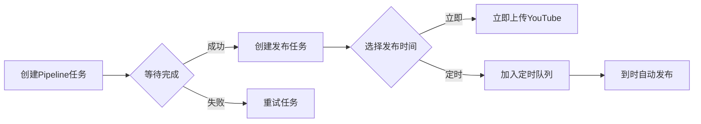

# API快速参考手册

## 基础信息
- **服务地址**: `http://localhost:51082`
- **API文档**: `http://localhost:51082/docs`

## 核心接口列表

### Pipeline任务管理

| 接口 | 方法 | 说明 |
|------|------|------|
| `/api/pipeline/run` | POST | 创建任务（支持account_name） |
| `/api/pipeline/status/{task_id}` | GET | 查询任务状态 |
| `/api/pipeline/result/{task_id}` | GET | 获取任务结果 |
| `/api/pipeline/task/{task_id}` | DELETE | 删除任务记录 |
| `/api/pipeline/retry/{task_id}` | POST | 重试失败任务 |
| `/api/pipeline/history` | GET | 查询历史记录 |
| `/api/pipeline/statistics` | GET | 获取统计信息 |

### 发布管理

| 接口 | 方法 | 说明 |
|------|------|------|
| `/api/publish/schedule` | POST | **推荐** 创建发布（支持定时） |
| `/api/publish/scheduler/queue` | GET | 查看定时队列 |
| `/api/publish/scheduler/{id}` | DELETE | 取消定时发布 |
| `/api/publish/scheduler/reschedule/{id}` | POST | 重新安排时间 |
| `/api/publish/history` | GET | 发布历史 |
| `/api/publish/retry/{id}` | POST | 重试发布 |

### 账号管理

| 接口 | 方法 | 说明 |
|------|------|------|
| `/api/accounts` | GET | 获取所有账号 |
| `/api/accounts/{id}` | GET | 账号详情 |
| `/api/accounts/{id}/statistics` | GET | 账号统计 |
| `/api/accounts/{id}/status` | PUT | 更新状态 |

---

## 最重要的接口

### 1. 创建任务 - `/api/pipeline/run`

```json
POST /api/pipeline/run
{
  "video_id": "YouTube视频ID",
  "creator_id": "创作者ID", 
  "account_name": "账号名称",  // 新增：会绑定到文件名
  "gender": 1,                 // 0=男, 1=女
  "duration": 60,
  "export_video": false,
  "enable_subtitle": true       // 默认开启字幕
}

响应:
{
  "task_id": "creator_001_my_channel_video_001_abc123",
  "message": "任务已启动",
  "status_url": "/api/pipeline/status/...",
  "result_url": "/api/pipeline/result/..."
}
```

### 2. 定时发布 - `/api/publish/schedule`

```json
POST /api/publish/schedule
{
  "task_id": "Pipeline任务ID",
  "account_ids": ["account_001", "account_002"],
  "video_title": "视频标题",
  "video_description": "描述",
  "video_tags": ["tag1", "tag2"],
  "thumbnail_path": "/absolute/path/to/thumbnails/task_id_20241201_120000.jpg",  // 可选，绝对路径
  "scheduled_time": "2024-12-25T10:00:00",  // 可选，不填立即发布
  "privacy_status": "public"
}

响应:
{
  "message": "创建了 2 个发布任务（0个立即发布，2个定时发布）",
  "results": [...],
  "summary": {
    "total": 2,
    "immediate": 0,
    "scheduled": 2,
    "failed": 0
  }
}
```

### 3. 删除任务 - `/api/pipeline/task/{task_id}`

```json
DELETE /api/pipeline/task/creator_001_my_channel_video_001_abc123

响应:
{
  "message": "任务删除成功",
  "task_id": "creator_001_my_channel_video_001_abc123",
  "deleted_publish_tasks": 2
}
```

### 4. 查询任务状态 - `/api/pipeline/status/{task_id}`

```json
GET /api/pipeline/status/creator_001_my_channel_video_001_abc123

响应:
{
  "task_id": "...",
  "status": "running",  // pending/running/completed/failed
  "current_stage": "语音生成",
  "progress": {
    "故事二创": "成功",
    "语音生成": "运行中",
    "剪映草稿生成": "待处理"
  }
}
```

---

## 新功能说明

### 🆕 账号名称绑定 (account_name)

在创建任务时添加 `account_name` 参数，会：
- 绑定到任务ID：`creator_id_account_name_video_id_uuid`
- 绑定到文件路径：`outputs/creator_id/account_name/video_id/`
- 绑定到文件名：`creator_id_account_name_video_id_timestamp.mp4`

### 🆕 定时发布功能

- **立即发布**: 不设置 `scheduled_time`
- **定时发布**: 设置未来的 `scheduled_time`
- **查看队列**: GET `/api/publish/scheduler/queue`
- **取消任务**: DELETE `/api/publish/scheduler/{id}`
- **修改时间**: POST `/api/publish/scheduler/reschedule/{id}`

### 🆕 任务重试

- **Pipeline重试**: POST `/api/pipeline/retry/{task_id}`
- **发布重试**: POST `/api/publish/retry/{publish_id}`
- 会生成新的任务ID，保留原始参数

### 🆕 任务删除

- **删除任务**: DELETE `/api/pipeline/task/{task_id}`
- 只删除数据库记录，不删除生成的文件
- 会自动删除相关的发布任务记录

---

## 典型使用流程



---

## 状态码速查

### Pipeline状态
- `pending` - 待处理
- `running` - 运行中
- `completed` - 已完成
- `failed` - 失败

### 发布状态
- `pending` - 待发布
- `scheduled` - 已安排（定时）
- `uploading` - 上传中
- `success` - 成功
- `failed` - 失败
- `cancelled` - 已取消

---

## 常用命令示例

```bash
# 创建任务（带账号名）
curl -X POST http://localhost:51082/api/pipeline/run \
  -H "Content-Type: application/json" \
  -d '{"video_id":"abc123","creator_id":"user001","account_name":"my_channel"}'

# 查看状态
curl http://localhost:51082/api/pipeline/status/{task_id}

# 上传缩略图（返回绝对路径）
curl -X POST http://localhost:51082/api/publish/upload-thumbnail \
  -F "task_id={task_id}" \
  -F "file=@/path/to/thumbnail.jpg"

# 立即发布（使用缩略图的绝对路径）
curl -X POST http://localhost:51082/api/publish/schedule \
  -H "Content-Type: application/json" \
  -d '{"task_id":"{task_id}","account_ids":["account_001"]}'

# 定时发布（圣诞节）
curl -X POST http://localhost:51082/api/publish/schedule \
  -H "Content-Type: application/json" \
  -d '{"task_id":"{task_id}","account_ids":["account_001"],"scheduled_time":"2024-12-25T10:00:00"}'

# 查看定时队列
curl http://localhost:51082/api/publish/scheduler/queue

# 重试失败任务
curl -X POST http://localhost:51082/api/pipeline/retry/{task_id}

# 删除任务记录
curl -X DELETE http://localhost:51082/api/pipeline/task/{task_id}
```

---

## 注意事项

1. ⚠️ **account_name** 是可选参数，但建议提供以便管理
2. ⚠️ 定时发布精度为 **±30秒**
3. ⚠️ 时间格式必须是 **ISO 8601** (YYYY-MM-DDTHH:MM:SS)
4. ⚠️ 发布前必须等Pipeline任务 **completed**
5. ⚠️ 服务重启会自动恢复定时任务

---

更新日期: 2024-12-01 | 版本: v0.2.0